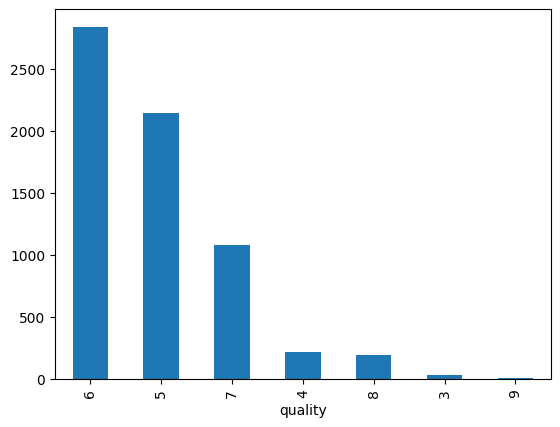

# Wine Quality Prediction (as a Binary Classification Problem)


## Introduction

This project is to predict the quality of wine based on the physicochemical tests. The dataset is from [UCI Machine Learning Repository](https://archive.ics.uci.edu/ml/datasets/wine+quality). The dataset contains 11 variables and 4898 observations. The variables are:

1. fixed acidity
2. volatile acidity
3. citric acid
4. residual sugar
5. chlorides
6. free sulfur dioxide
7. total sulfur dioxide
8. density
9. pH
10. sulphates
11. alcohol
12. quality (score between 0 and 10)

## Model

The model is built using scikit-learn pipeline. The pipeline includes the following steps:

1. replace missing values with median
2. HotEncode the categorical variables. In this case there are no categorical variables.
3. Use Random Forest to predict the quality of wine.

## Optimization

The model is optimized using Hyperopt. The hyperparameters optimized are:

1. n_estimators: number of trees in the forest
2. max_depth: maximum depth of the tree

The optimization is done using Tree of Parzen Estimators (TPE) algorithm. The optimization is done using 20 iterations.

## Data Processing. 

For data processing, the dataset is transformed into a binary classification problem, where 1 represents good quality and 0 represents bad quality. This transformation is mainly due to the significant imbalance in wine quality classes. Outlier removal is performed using the interquartile method.



As part of the data processing workflow, three datasets are created: train, test, and validation (val). The train and validation datasets are used during the optimization process, while the test dataset is used to evaluate the model.

## USAGE

### **Clone the repository** 

```bash 
git clone https://github.com/manuelgilm/data_science-portafolio
cd classification/wine_quality_v1
```

### **Install The Package and create virtual environment** 
run:
```bash
poetry install
```
This will create a `.venv` folder within the project.

### **Run Data Preparation** 
run:
```bash
poetry run prepare_data
```

This will create the three datasets Train/test/validation in the folder `output`

### **Training and Optimize a Model**

run:
```bash
poetry run run
```

It will use hypropt to find the best parameters and log the best model using mlflow.
The best model will also be registered with Mlflow Model Registry

### **Evaluate the model**
run:
```bash
poetry run evaluate
```

This will score the test dataset and log the metrics in the best run.

### **Start MLflow UI** 

For visualizing the experiments on MLFlow UI

run: 

```bash
poetry run mlflow ui
```


## Contributing

If you want to contribute to this project and make it better, your help is very welcome. Contributing is also a great way to learn more and improve your skills. You can contribute in different ways:

- Reporting a bug
- Coming up with a feature request
- Writing code
- Writing tests
- Writing documentation
- Reviewing code
- Giving feedback on the project
- Spreading the word
- Sharing the project
  
## Contact

If you need to contact me, you can reach me at:

- [manuelgilsitio@gmail.com](manuelgilsitio@gmail.com)
- [linkedin](www.linkedin.com/in/manuelgilmatheus)