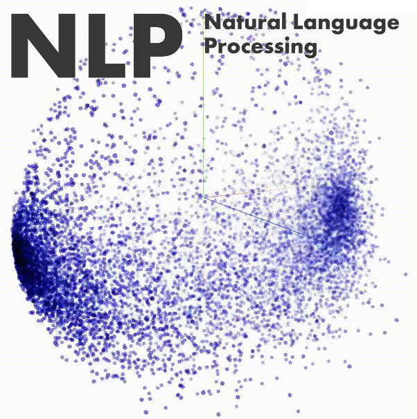
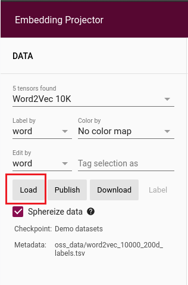
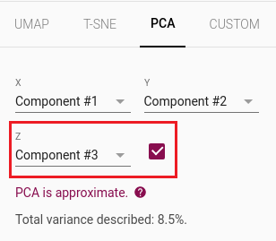

    

# Movie review classification.

In this project I will show you how to use TensorFlow to implement a basic text classifier. The goal of this project is to classify a movie review as a positive review or negative review. The dataset can be downloaded from the following [link](https://www.kaggle.com/lakshmi25npathi/imdb-dataset-of-50k-movie-reviews?select=IMDB+Dataset.csv)
 
## Running the notebook.

### Using Anaconda environment.

To run the provided notebook you need to create a new anaconda environment. You can create a new environment with all the libraries required using the moviereview_classification_with_ml.yml file and run the following line:

    conda env create -f moviereview_classification_with_ml.yml
    conda activate activate moviereview_classification_with_ml

After activating the environment you can run the jupyter notebook.

### Using Docker.

You can use **Docker** to run the **Jupyter Notebook** directly, you only need to follow the next steps.

    docker pull gilsama/wordembeddings_moviereviewclassification
    docker run -p 8888:8888 gilsama/wordembeddings_moviereviewclassification

## Visualizing the Embedding Layer

To visualize the **Embedding Space**, you need to upload some files to this [website](https://projector.tensorflow.org/). The files are:
* vecs.tsv
* meta.tsv

On the left side of the website you will see an option to upload the data.

  

To visualize the Embedding space you need to reduce the dimension of the vectors, **Embedding Projector** provides some algorithms, but we should use *PCA* and be sure to select the 3D component.

    

