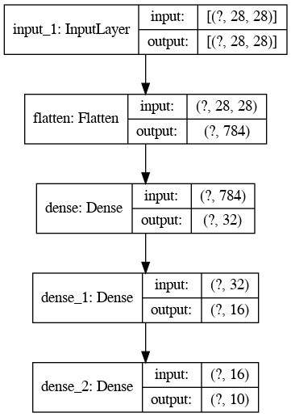

# Using callbacks in tensorflow.

This notebook show you how to implement callbacks with tensorflow. 

## Dataset used.

I used the popular Fashion Mnist dataset to demonstrate how to use callbacks. This dataset contains items of clothing that look like this:

## Model Architecture

I used the following neural network architecture to test the callbacks.

