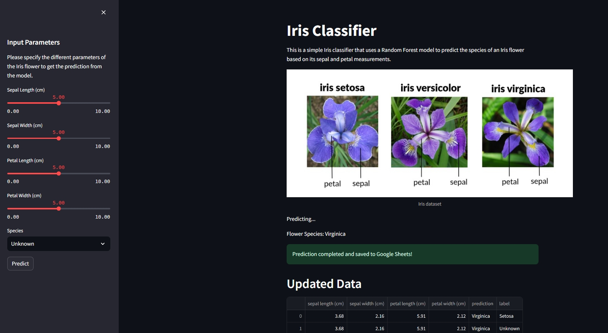

# Basic Machine Learning Application with Kubernetes

This project deploys a simple machine learning model using Azure Kubernetes. The intent of this project is to showcase a basic implementation of Kubernetes for ML. The visual interface is built with Streamlit, and the storage system uses Google Sheets.

## Iris classifier

The machine learning model used for this project is a classic Iris classifier. You can find more information about this project in this link: [Iris Classifier](https://github.com/manuelgilm/data_science-portafolio/blob/master/classification/iris_classifier/README.md)

## Visualization.

Streamlit was used to develop the interface. You can provide the feature input and observe past predictions through this interface.

## Google Sheet Connection.

## Kubernetes Architecture.

## Contributing

If you want to contribute to this project and make it better, your help is very welcome. Contributing is also a great way to learn more and improve your skills. You can contribute in different ways:

- Reporting a bug
- Coming up with a feature request
- Writing code
- Writing tests
- Writing documentation
- Reviewing code
- Giving feedback on the project
- Spreading the word
- Sharing the project