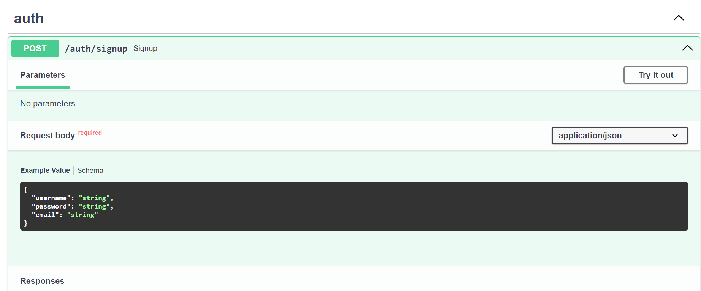
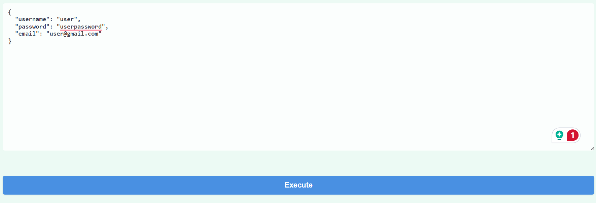
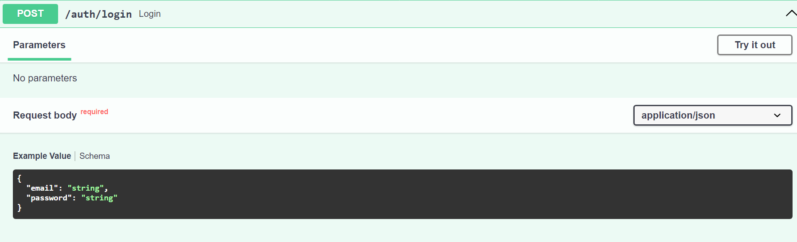
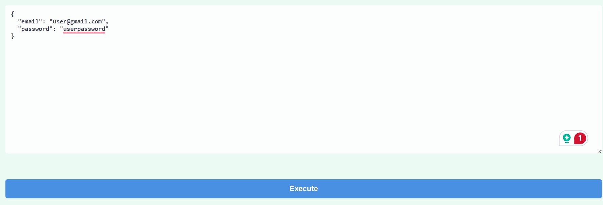
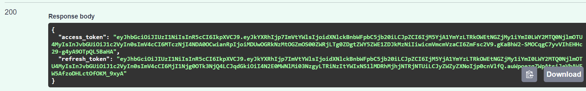
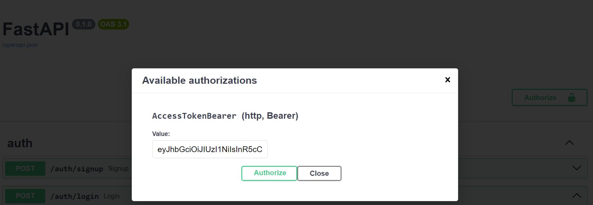
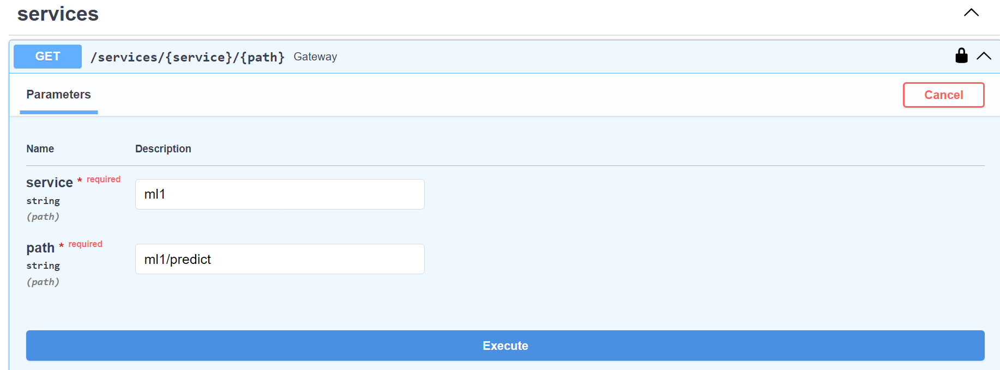
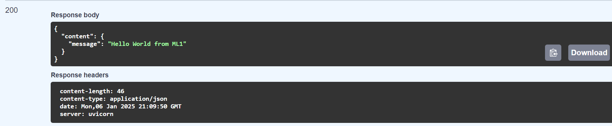

# Machine Learning Models as Microservices.
This project demonstrates how to deploy machine learning models as microservices. By containerizing models and using RESTful APIs, we can easily integrate machine learning capabilities into various applications, ensuring scalability, maintainability, and ease of deployment.

## Project Architecture.

## How to test.
To run the code, it is necessary to install Docker. For the next steps, assume that Docker is already installed.

1. Clone the Repository.
```
git clone https://github.com/manuelgilm/data_science-portafolio.git`
```
2. Go to the respective directory.
```
cd data_science-portafolio/mlops/ml_microservices
```
3. Run Docker.
```
docker compose up --build
```
4. Go to the browser and enter `http:localhost:8000/docs` and you will see FastAPI Documentation. 

### Using API Docs.

#### Create an User:

Go to signup endpoint.


Create a new user.


Once the user is created. Go to login endpoint.


Use the just created user.


Copy the generated `access_token`


Authorize using the UI.


Now you can  use the ML services. For example, Service 1.


Done! Now you have the prediction.

