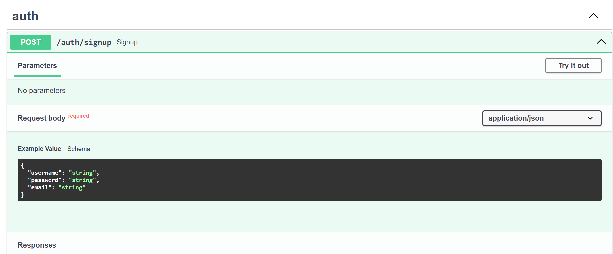
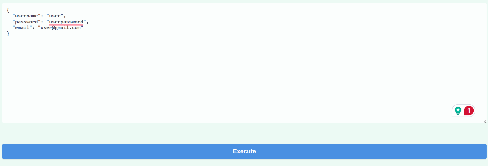
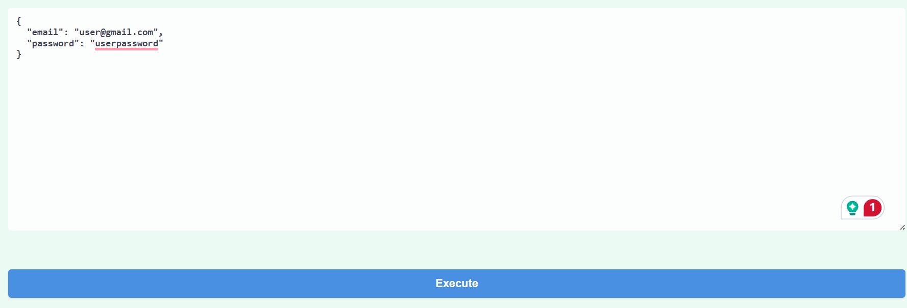
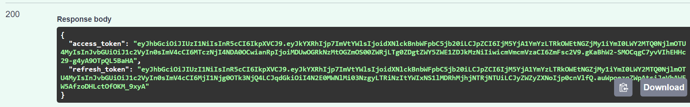
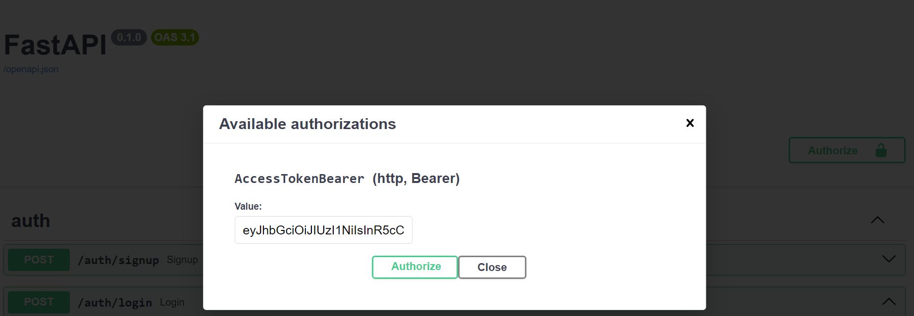
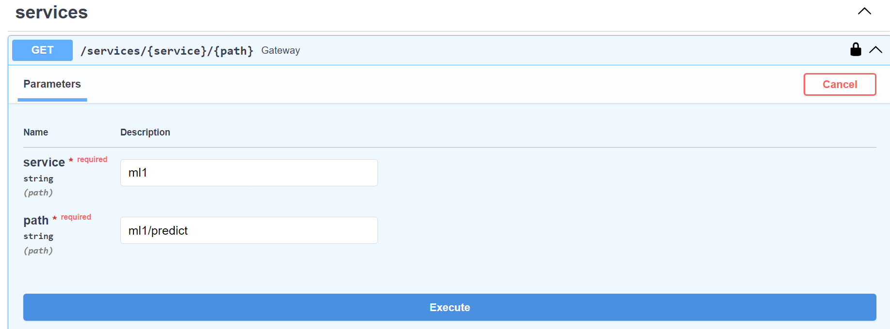
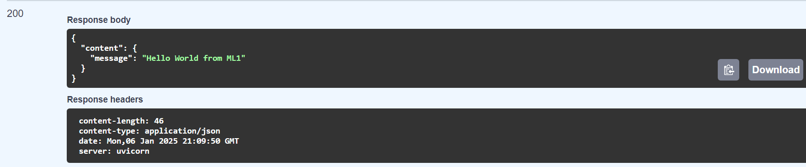

# Machine Learning Models as Microservices.
This project demonstrates how to deploy machine learning models as microservices. By containerizing models and using RESTful APIs, we can easily integrate machine learning capabilities into various applications, ensuring scalability, maintainability, and ease of deployment.

## Project Architecture.

<TODO>

## How to test.
To run the code, it is necessary to install Docker. For the next steps, assume that Docker is already installed.

1. Clone the Repository.
```
git clone https://github.com/manuelgilm/data_science-portafolio.git`
```
2. Go to the respective directory.
```
cd data_science-portafolio/mlops/ml_microservices
```
3. Run Docker.
```
docker compose up --build
```
4. Go to the browser and enter `http:localhost:8000/docs` and you will see FastAPI Documentation. 

### Using API Docs.

#### Create an User:

Go to signup endpoint.


Create a new user.


Once the user is created. Go to login endpoint.


Use the just created user.


Copy the generated `access_token`


Authorize using the UI.


Now you can  use the ML services. For example, Service 1.


Done! Now you have the prediction.


## Contributing
If you want to contribute to this project and make it better, your help is very welcome. Contributing is also a great way to learn more and improve your skills. You can contribute in different ways:

* Reporting a bug
* Coming up with a feature request
* Writing code
* Writing tests
* Writing documentation
* Reviewing code
* Giving feedback on the project
* Spreading the word
* Sharing the project

## Contact
If you need to contact me, you can reach me at:

* [manuelgilsitio@gmail.com](manuelgilsitio@gmail.com)
* [linkedin](www.linkedin.com/in/manuelgilmatheus)
